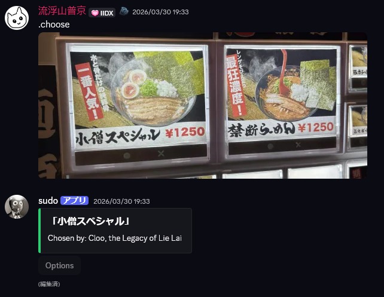

## Changelog

- 2026.04.02 Release.


<br></br>

# Extafia Discord Bot

**Extafia** is a feature-rich Discord bot built around a competitive game system with in-game currency, enchantments, and multiplayer arena battles.  
It runs on **Python 3.12 + discord.py**, fully integrated with **Google Cloud Platform (GCP)** services.

<br></br>
# Features

| Command | Description |
|----------|--------------|
| `/h` | Get help |
| `/lang` | Switches interface language (English / Japanese / Traditional Chinese) |
| `/choose(.choose)` | Randomly selects from given options (1% chance to generate a special phrase) |
| `/arena` | Dice-based multiplayer arena. Users bet currency; results are affected by enchantments |
| `/enchant` | Roll new enchantments that influence arena outcomes or rewards |
| `/vaal` | Corrupt your cock to get further strength |
| `/stat` | Displays user info: language, currency, enchantments, and developer privileges |
| `.vhs` | Apply a VHS-style filter to an attached image or GIF, replied media, or recent media, with optional tuning |
---
<br>

## Choose

Choose one from given choices.

".choose" is also support.

Usage examples:
```bash
/choose 打機 回家
.choose 拉麵 拉麵 拉麵
```
### (Beta) OCR choose

Extafia can also pick a choice from uploaded/replied image.

If type ".choose" without any choices or attachments, the latest iamge in text channel will be targeted.




## VHS Command

Add VHS effect to targeted images, even .gif.

Usage examples:
```bash
.vhs
.vhs 60
.vhs 60 noise=80 scanline=400 rgb=60
.vhs noisebar
.vhs lofi
.vhs lofi=80
.vhs 60 noise=80 scanline=400 rgb=60 noisebar lofi
.vhs 60 noise=80 scanline=400 rgb=60 noisebar lofi=90
```

Parameters:
- `strength`: overall VHS effect strength, range `1-100`, default `30`
- `noise`: static/noise intensity, range `0-100`, default `50`
- `scanline`: scanline intensity, range `0-1000`, default `300`
- `rgb`: RGB channel shift intensity, range `0-200`, default `100`
- `noisebar`: optional tracking-noise bar effect for stronger glitch on the output
- `lofi`: optional low-fidelity strength, range `1-100`, default `100`

Notes:
- The first bare number is treated as `strength`
- `scan=120` also works as a shorter alias for `scanline=120`
- Add `noisebar` to enable the extra moving tracking-noise bar effect
- Add `lofi` to use the default low-fidelity strength, or `lofi=80` to tune it manually
- Values above the recommended range are clamped internally per option
- Animated GIFs are processed frame-by-frame and returned as GIFs

## Cock Arena & Enchantment

Have a cock battle with your friends! (Single mode WIP)

How to play: type "/arena" and you will get it

Player at the last place in arena have to pay currency `Shing Coin` to winner. Bet amount will be random.

---

### Enchantment

Enchant and dominate the arena!

Usage:

- ```/enchant (roll)```: spend 10 to get new enchantments.

- ```/enchant show```: show your cock enchantment

Notes: 
- 1 cock contains of maximum 2 prefixes and 2 suffixes.
- (Skill list will be released soon.)

---

### Vaal

Use vaal to corrupt your cock and upgrade enchanted skill.

Usage:
- ```/vaal```: spend 1 to corrupt your cock

Notes:
- The enhancement effect of Vaal is based on the enchanted skill on your cock.
- After Vaal, your cock becomes corrupted and cannot be vaaled again until you obtain a new enchantment via ```/enchant```.
- Vaal can succeed, have no effect, or fail.

## Currency

A currency issued based on the likeness of our great exalted master, `yip10101`.

1 is worth 100, and 1 is worth 100.

Special Thanks: @mfasa, @cloo

<br></br>

# Installation

## System Overview

- **Language:** Python 3.12 (Dockerized)
- **Framework:** `discord.py`
- **Database:** Firestore (GCP)
- **Authentication:** Google Application Default Credentials (ADC)
- **(WIP)Backend:** Cloud Functions + API Gateway
- **(WIP)Scheduler:** Cloud Scheduler (for daily events and uptime pings)

<br>

## Project Structure

```bash
extafia/
├── service/                # Core logic (arena, enchantment, etc.)
├── cogs/                   # Discord command modules
├── constants.py            # Dataclasses, enums, bitfield constants
├── user_data.py            # Firestore I/O + in-memory cache
├── msg_utils.py            # Multilingual message resolver
├── docker_tools.sh         # Docker build/run helper script
├── Dockerfile
└── requirements.txt
```
<br>

## Environment Setup

1. Create `.env`<br>
Setup your bot enivornment at extafia/.
```bash
DISCORD_TOKEN=your_discord_bot_token
PROJECT_ID=your_gcp_project_id
OPEN_AI_API_KEY=your_openai_api_key
OPEN_AI_MODEL=gpt-4o
```

2. Prepare ADC
```bash
gcloud auth application-default login
gcloud config set project your_gcp_project_id
```

For Cloud Run / Compute Engine, attach a runtime service account with Firestore access and ADC will be available automatically.

3. Install Dependencies<br>
Using `docker_tools.sh`
```bash
# Build and run the container
./docker_tools.sh
```
> Default local ADC path:<br>
> `~/.config/gcloud/application_default_credentials.json`
> You can override it with:
> ```bash
> ADC_PATH=/path/to/application_default_credentials.json ./docker_tools.sh
> ```


## GCP Deployment Guide

1. Push the Docker image to Artifact Registry.
2. Deploy to Cloud Run or Compute Engine (VM).
3. Use Cloud Scheduler to ping the bot periodically (keep it alive).
4. Optionally, manage backend requests through API Gateway.

## Security Notes

- When running multiple instances, use Firestore transactions to avoid race conditions.
- Actually newbie in security, welcome any suggestions about data saving, API, etc.

## Localization

Supported languages:
- English (en)
- Japanese (jp)
- Written Cantonese (zh)

All texts are handled dynamically via `msg_utils.py` and translation dictionaries in `lang_data/`.  

## License

This project is licensed under the [MIT License](LICENSE).

## Contact / Support
Developer: 黒矢  
Discord: @ltkaz

For GCP deployment details, refer to:
- [Google Cloud Run Docs](https://cloud.google.com/run/docs)
- [Cloud Scheduler Docs](https://cloud.google.com/scheduler/docs)

For bugs or feature requests, please open an Issue in this repository.
