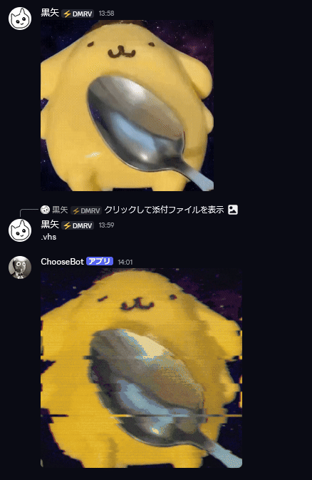

# Command Guide

[Back to README](../README.md)

## Choose

Randomly select an option using `/choose` or the `.choose` prefix command.

Usage examples:
```text
/choose coffee tea
.choose ramen sushi curry
```
### Image-Based Selection (Beta)

Extafia can extract options from an uploaded image or an image in a replied-to message, then select one of the extracted options.

When `.choose` is used without text options or an attached image, the bot checks the replied-to message, then searches recent channel messages for an image.


## VHS Command

Apply configurable VHS effects to static images and animated GIFs.



Usage examples:
```text
.vhs
.vhs 60
.vhs 60 noise=80 scanline=400 rgb=60
.vhs noisebar
.vhs lofi
.vhs lofi=80
.vhs 60 noise=80 scanline=400 rgb=60 noisebar lofi
.vhs 60 noise=80 scanline=400 rgb=60 noisebar lofi=90
```

Parameters:

- `strength`: overall VHS effect strength, range `1-100`, default `35`
- `noise`: static/noise intensity, range `0-100`, default `50`
- `scanline`: scanline intensity, range `0-1000`, default `800`
- `rgb`: RGB channel shift intensity, range `0-200`, default `120`
- `noisebar`: optional tracking-noise bar effect for stronger glitch on the output
- `lofi`: optional low-fidelity strength, range `1-100`, default `100`

Notes:

- The first number without a parameter name is treated as `strength`
- `scan=120` also works as a shorter alias for `scanline=120`
- Add `noisebar` to enable the extra moving tracking-noise bar effect
- Add `lofi` to use the default low-fidelity strength, or `lofi=80` to tune it manually
- Values above the recommended range are clamped internally per option
- Animated GIFs are processed frame-by-frame and returned as GIFs

## Arena and Enchantments

Compete in multiplayer arena battles with dice-based outcomes and enchantment modifiers.

Use `/arena` to start a battle and follow the in-channel prompts.

The last-place player pays the winner in `Shing Coin`. The wager amount is randomized.

---

### Enchantment

Generate enchantments that modify battle outcomes and rewards.

Usage:

- `/enchant`: spend 10 to generate new enchantments.

- `/enchant action:show`: display current enchantments.

Each enchantment set supports up to two prefixes and two suffixes.

---

### Vaal

Apply a corruption effect to the current enchantment set. The outcome may improve or weaken existing enchantments, or leave them unchanged.

Usage:

- `/vaal`: spend 1 to apply a corruption effect.

Notes:

- The corruption effect depends on the current enchantments.
- Corruption can be applied only once per enchantment set. Use `/enchant` to generate a new set before applying it again.

## Currency

Shing Coin is the in-game currency used for arena wagers, enchantments, and corruption. Its artwork is based on community member `yip10101`. 

1 is worth 100, and 1 is worth 100.